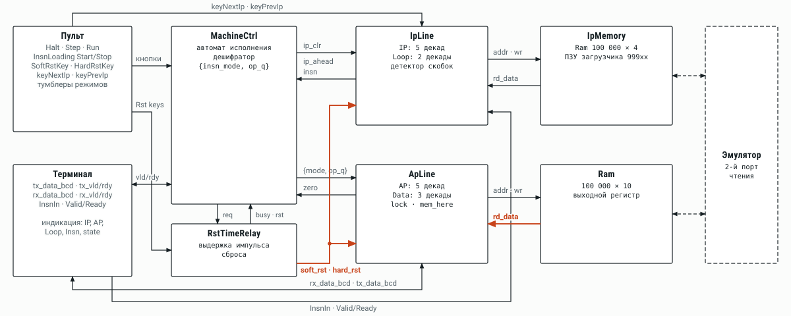

# DekatronPC

Ламповый компьютер на декатронах А110 с системой команд Brainfuck. Счётчики машины — реверсивные декатроны: они умеют ровно то, что нужно Brainfuck, — прибавить и отнять единицу. Логика вокруг них — вакуумные лампы 6Н16Б и 6Ж2Б, без кремниевых полупроводников в вычислительном тракте.

*A vacuum-tube Brainfuck computer built around A110 dekatron counting tubes. RTL in SystemVerilog, an FPGA emulator for blocks not yet built, requirements and microarchitecture docs in Russian.*



## Машина

| Параметр | Значение |
|---|---|
| Архитектура | гарвардская: отдельные память программ и память данных |
| Система команд | Brainfuck и отладочный набор, по 16 опкодов, 4 бита на команду |
| Счётчик команд IP | 5 декатронов, 0…99999 |
| Счётчик вложенности Loop | 2 декатрона, 0…99 (в RTL пока 3) |
| Указатель данных AP | 5 декатронов, предел 29999 (99999 — открытый вопрос OPEN-001) |
| Значение ячейки Data | 3 декатрона, 0…255 |
| Всего декатронов | 15 |
| Память программ | 100 000 × 4 бит, верхний банк 99900…99999 — ПЗУ загрузчика |
| Память данных | 30 000 ячеек × 10 бит (BCD: сотни, десятки, единицы) |
| Тактовая частота | 1 МГц (цель; калибровка таймингов декатрона — OPEN-013/014) |
| Логика | ≈ 2600 ламп по синтезу RTL в библиотеку ламповых ячеек, без памяти |

Адреса и данные хранятся в BCD прямо так, как их показывают декатроны: память адресуется тетрадами без перевода в двоичный код. Цикл просматривается самой линией выборки: при `[` с нулевой ячейкой или `]` с ненулевой IP проматывается до парной скобки, счётчик Loop считает вложенность.

Конфигурация счётчиков проверена на наборе из ста реальных программ с GitHub — [Brainfuck-100](https://github.com/radiolok/bfutils/tree/claude_nextGen/programs/bf100) в сабмодуле `bfutils`: в 5 + 2 + 5 + 3 декатрона помещаются 97 программ из 100.

## Система команд

Команда декодируется по паре {режим, опкод}. Неопределённые и зарезервированные опкоды исполняются как NOP.

| Опкод | Отладочный набор (режим 0) | Brainfuck (режим 1) |
|---|---|---|
| 0x0 | NOP | NOP |
| 0x1 | HALT | HALT |
| 0x2 | BELL | `+` INC |
| 0x3 | — (NOP) | `-` DEC |
| 0x4 | EOT — конец загрузки | `>` AINC |
| 0x5 | SOT — начало загрузки | `<` ADEC |
| 0x6 | `{` — пропуск, если AP = 0 | `[` LBEG |
| 0x7 | `}` — повтор, если AP ≠ 0 | `]` LEND |
| 0x8 | CLRL — Loop ← 0 | `.` COUT |
| 0x9 | CLRI — IP ← 0 | `,` CIN |
| 0xA | CLRD — ячейка ← 0 | `[-]` CLRD |
| 0xB | CLRA — AP ← 0 | CLRML — выгрузить и снять MemLock |
| 0xC | HRST — аппаратный сброс | LOAD |
| 0xD | SRST — программный сброс | STORE |
| 0xE | ISA0 — в отладочный набор | ISA0 |
| 0xF | ISA1 — в Brainfuck | ISA1 |

Аппаратный сброс ставит IP = 99900 и запускает загрузчик из ПЗУ; программный — IP = 0. Полная семантика, MemLock и ленивое чтение памяти данных — в [TRS.md](TRS.md), разделы 6–10.

## Документы

| Документ | Что в нём |
|---|---|
| [TRS.md](TRS.md) | требования: архитектура, ISA, память, декатроны, RTL, верификация, стенд, ламповые модули, открытые вопросы, чек-лист и план работ. Каждое требование имеет ID (`REQ-*`, `OPEN-*`) и статус |
| [SCHEMES.md](SCHEMES.md) | структурные схемы ядра в семи листах: декатрон, модуль, счётчик, IpLine, ApLine, MachineCtrl, верхний уровень |
| [doc/dpcrun_golden_model.md](doc/dpcrun_golden_model.md) | C++ golden model: семантика, расхождения RTL и TRS, найденные дефекты |
| [tb/README.md](tb/README.md) | testbench на cocotb и pyuvm |
| [rtl/DekatronPC/Dekatron/DekatronCounter.md](rtl/DekatronPC/Dekatron/DekatronCounter.md) | устройство декатронного счётчика |
| [rtl/DekatronPC/emulator_inspection.md](rtl/DekatronPC/emulator_inspection.md) | разбор слоя эмулятора на ПЛИС |
| [history.md](history.md) | журнал сессий работы над проектом |

## Репозиторий

| Путь | Содержимое |
|---|---|
| `rtl/DekatronPC/` | ядро: `DekatronPC.sv`, `MachineCtrl.sv`, `IpLine.sv`, `ApLine.sv`, `IpMemory.sv`, `RAM.sv`, верх для DE0-Nano `De0Nano.sv` |
| `rtl/DekatronPC/Dekatron/` | декатрон: модель лампы `DekatronTubeV2`, модуль, счётчик, генератор фаз, формирователь импульсов |
| `rtl/parameters.sv` | разрядность счётчиков |
| `rtl/Emulator/` | слой эмулятора на ПЛИС: клавиатура, индикатор МС6205, ИН-12, загрузчик прошивки |
| `rtl/Logic/`, `rtl/Functions/` | примитивы и кодеры |
| `rtl/vtube/` | библиотека ламповых ячеек `vtube_cells.lib` для синтеза |
| `rtl/programs/` | тестовые программы `*.bfk` и загрузчик |
| `rtl/run/` | скрипты моделирования, синтеза и подсчёта ламп |
| `rtl/quartus/` | проект Quartus |
| `tb/` | testbench на cocotb и pyuvm |
| `bfutils/` | сабмодуль [radiolok/bfutils](https://github.com/radiolok/bfutils): компилятор, эмулятор, golden model `dpcrun`, набор Brainfuck-100 |
| `sch/` | схемы KiCad: эмулятор, экспериментальная декатронная ячейка, библиотеки ламп |
| `doc/` | отчёты и справочная литература |
| `img/schemes/` | картинки для SCHEMES.md |
| `tools/schemes/` | генератор SCHEMES.md и картинок схем: `python3 tools/schemes/build.py` |

Блоки `Dekatron.sv`, `DekatronPulseAllow`, `DekatronCarrySignal`, `InsnDecoder`, `BcdToBinEnc` в тракте памяти и папка `rtl/[DEPRECATED]` — старый тракт, подлежит удалению (TRS, раздел 19.4).

## Сборка и проверка

```bash
git clone --recursive https://github.com/radiolok/dekatronpc.git
cd dekatronpc
git submodule update --init       # если клонировали без --recursive

docker build -t dekatron-pc .     # Verilator, Icarus, Yosys, cocotb — то же окружение, что в CI
```

| Задача | Команда |
|---|---|
| один тест на Icarus | `cd tb && make test_compare SIM=icarus` |
| регрессия cocotb | `cd tb && make regression` |
| моделирование RTL | `cd rtl/run && ./run_tests.sh -t` |
| синтез в лампы (Yosys) | `cd rtl/run && ./run_tests.sh -s` |

Полная сборка DekatronPC и эмулятора в Verilator и синтез — тяжёлые задачи; на слабой машине начинайте с одиночных целей на Icarus. CI: `.github/workflows/docker-image.yml`.

## Состояние

- Готово в RTL: модель декатрона, декатронный счётчик с Valid/Ready, линии IpLine и ApLine с ленивым чтением, MachineCtrl, банковая память, синтез в ламповые ячейки.
- Golden model `bfutils/dpcrun` поддерживает полный ISA; пошаговое сравнение с RTL ждёт исправления вывода `.` (OPEN-017).
- Решения, ещё не внесённые в RTL: Loop на 2 декатрона, сброс `lock` в ApLine при смене адреса, вывод через `AP_COUT`.
- Следующие этапы: прогон всех новых блоков в Verilator и Icarus, испытательный стенд, экспериментальная декатронная ячейка и калибровка таймингов, первые ламповые модули.

Полный чек-лист — в TRS.md, разделы 19–22.
