# DekatronPC — структурные схемы

Микроархитектура ядра DekatronPC в семи листах, снизу вверх: от модели лампы А110 до верхнего уровня машины. Схемы сверены: RTL ветки claude_nextGen, 07.10.2026. Требования — в [TRS.md](TRS.md).

**Обозначения.** Оранжевым выделено то, о чём лист: путь разряда, цепочка переноса, ленивое чтение. Пурпурным пунктиром — найденный дефект RTL. Пунктирные блоки есть только при соответствующем параметре. Логические элементы — по ГОСТ 2.743.

## Листы

1. [Модель декатрона DekatronTubeV2](#модель-декатрона-dekatrontubev2)
2. [Работа с декатроном: фазы, импульсы, модуль](#работа-с-декатроном-фазы-импульсы-модуль)
3. [Декатронный счётчик DekatronCounter](#декатронный-счётчик-dekatroncounter)
4. [Линия выборки IpLine](#линия-выборки-ipline)
5. [Линия данных ApLine](#линия-данных-apline)
6. [Управление машиной MachineCtrl](#управление-машиной-machinectrl)
7. [Машина целиком DekatronPC](#машина-целиком-dekatronpc)

## Модель декатрона DekatronTubeV2

*ЛИСТ 1 · ДПК-СХ-01 · источник: DekatronTubeV2.sv*

Модель повторяет физику А110: кольцо из 30 электродов, один горящий бит, переходы только по длительности импульсов на подкатодах. Логика вокруг лампы не может спросить её «готова ли» — она может лишь выдержать нужные интервалы.

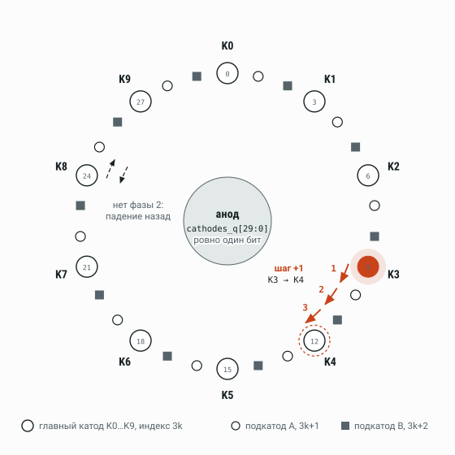

**Кольцо.** Шаг +1 из K3 в K4 за три трети такта: A, B и падение на следующий главный катод. Без второй фазы разряд падает назад.

| Разряд | Воздействие | Результат |
|---|---|---|
| Kₖ (3k) | GuideA ≥ GUIDE_STEP_HS | на подкатод A (3k+1) |
| A (3k+1) | GuideB ≥ GUIDE_STEP_HS | на подкатод B (3k+2) |
| B (3k+2) | нет стимула FALL_STEP_HS | вперёд на Kₖ₊₁ (3k+3) |
| A (3k+1) | нет стимула FALL_STEP_HS | назад на Kₖ (3k) |
| любой | write_en ≥ WRITE_MIN_HS | на катод write_pos |
| любой | reset0 / resetN ≥ RESET_MIN_HS | на K0 / K_RESET_N_POS |

Обратный шаг симметричен: GuideB уводит разряд с главного катода на B предыдущей тройки, GuideA — на A, падение доводит до Kₖ₋₁. Держать разряд на подкатоде нельзя, поэтому у лампы нет ни busy, ни ready: `main_onehot_o` достоверен, только когда разряд стоит на главном катоде и стимулов нет.

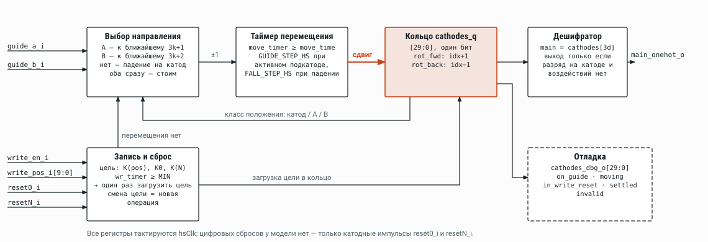

**Внутреннее устройство модели.** Таймер перемещения считает такты hsClk на подкатоде; запись и сброс имеют приоритет над шагом; дешифратор выдаёт позиционный код только на главном катоде.

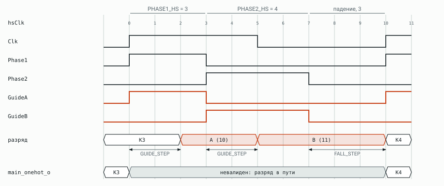

**Временная диаграмма шага.** Такт Clk делится на трети: Phase1 [0,3), Phase2 [3,6), падение [6,10) тактов hsClk. Разряд ложится на главный катод с запасом в один такт hsClk до следующего фронта Clk, поэтому шаг гарантированно укладывается в такт. При прежней нарезке 3/4/3 он падал ровно на фронте. Счёт идёт на каждом такте 1 МГц.

## Работа с декатроном: фазы, импульсы, модуль

*ЛИСТ 2 · ДПК-СХ-02 · источник: DekatronPhaseGen.sv · DekatronPulseSender.sv · DekatronModule.sv*

Генератор фаз один на счётчик; формирователь импульсов стоит в каждой декаде и только направляет фазы на подкатоды в нужном порядке. Схемы записи и чтения необязательны и включаются параметрами модуля.

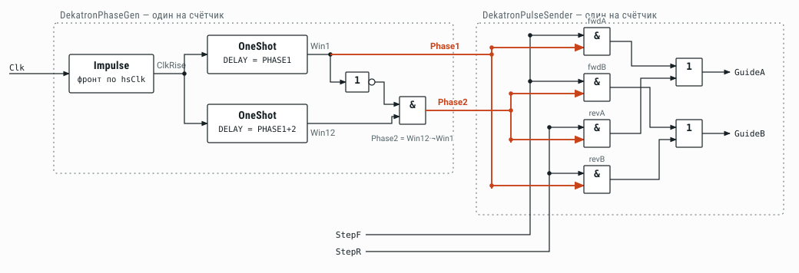

**DekatronPhaseGen и DekatronPulseSender.** Две задержки OneShot формируют окна, Phase2 = Win12·¬Win1. Шаг вперёд: GuideA ← Phase1, GuideB ← Phase2; шаг назад — наоборот. Обозначения элементов — ГОСТ 2.743.

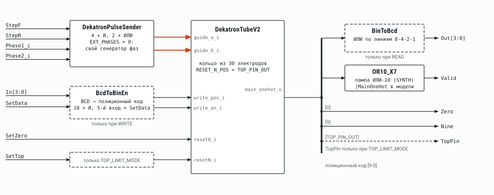

**DekatronModule.** Пунктиром — блоки, которые есть только при WRITE, READ и TOP_LIMIT_MODE. Каждый подблок остаётся отдельным экземпляром для размещения и трассировки. Признака Valid у модуля нет (TRS v0.10): он показывал только «разряд на главном катоде», а не «операция закончена». Готовность выводит `DekatronCounter` по известным длительностям.

## Декатронный счётчик DekatronCounter

*ЛИСТ 3 · ДПК-СХ-03 · источник: DekatronCounter.sv*

Счётчик превращает лампы без рукопожатия в блок с Valid/Ready. Готовность выводится из длительностей, а не из показаний ламп: шаг ±1 выполняется за такт без снятия ready; запись и подъём линии сброса запускают окно WR_WINDOW_HS, и ready снят до его конца. Линии soft_rst и hard_rst — физические: их длительность держит внешнее реле, счётчик только разводит их на SetZero и SetTop нужных декад.

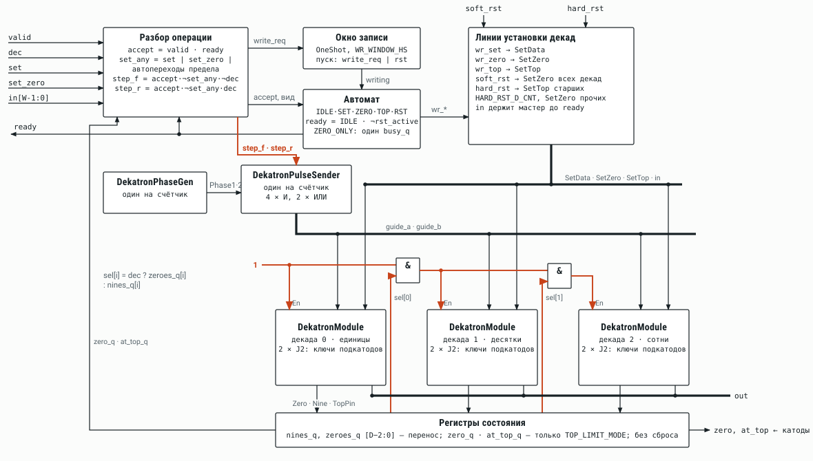

**Структура на трёх декадах.** Перенос берётся из признаков nines_q и zeroes_q, защёлкнутых по clk, поэтому цепочка step_f не замыкается комбинационно. ready не зависит от writing — так разорвана найденная ранее петля.

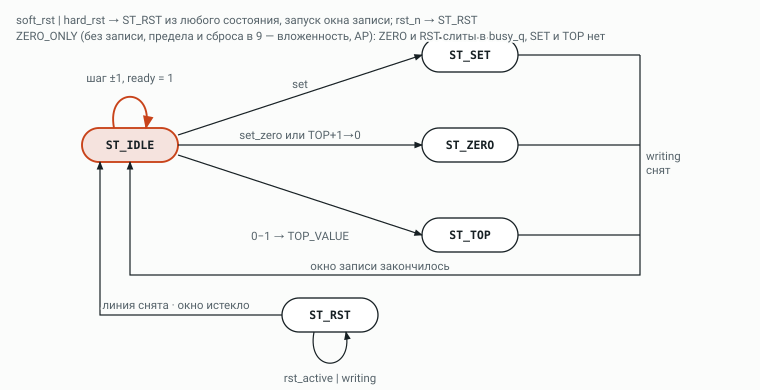

**Автомат счётчика.** TOP_LIMIT_MODE и HARD_RST_D_CNT взаимоисключающие (OPEN-012).

## Линия выборки IpLine

*ЛИСТ 4 · ДПК-СХ-04 · источник: IpLine.sv · IpMemory.sv · RAM.sv*

IpLine владеет счётчиком инструкций, счётчиком вложенности и памятью программ. Промотку тела цикла линия делает сама и останавливается на парной скобке; MachineCtrl получает уже следующую исполняемую инструкцию. На этом уровне нет символов — только 4-битные опкоды.

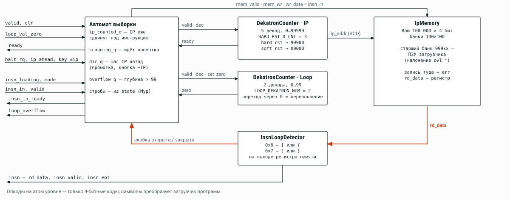

**Структура.** IP на пяти декадах: hard_rst ставит 99900 (старт загрузчика), soft_rst — 00000. Детектор скобок один, на выходе регистра памяти программ: собственного регистра опкода у IpLine нет, EOT приходит признаком insn_eot (REQ-IPV2-008).

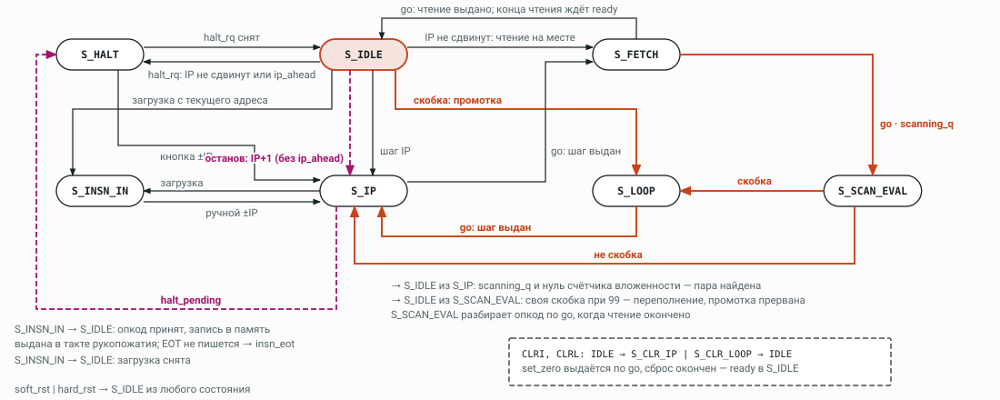

**Автомат.** Оранжевым — ветвь промотки. Переполнение счётчика вложенности ловится до шага (своя скобка при 99), обрывает промотку и выдаёт loop_overflow. Стробы счётчикам и памяти дешифрируются из состояния; пар OP/WAIT нет (REQ-IPV2-007). Счётчик — 2 декады (0…99), `LOOP_DEKATRON_NUM = 2` (REQ-CNT-002).

> **Дефект, отмечен пунктиром.** Если halt_rq приходит, когда IP уже сдвинут под инструкцию, IDLE делает IP+1 без промотки и уходит в HALT. В шаговом режиме это ломает каждую `[` при нулевой ячейке и каждую `]` при ненулевой; в режиме Run — останов сразу после такой скобки. Исправление ждёт решения: не трогать IP при останове или промотать при останове, если текущая инструкция — скобка.

## Линия данных ApLine

*ЛИСТ 5 · ДПК-СХ-05 · источник: ApLine.sv · RAM.sv*

Ленивое чтение: ячейка читается, только когда её значение действительно нужно, и выгружается, только если счётчик её изменил. Значение берётся из выходного регистра памяти напрямую — без копирования в счётчик данных. На программе Pi это 99 077 обращений против 155 625 при предвыборке (−36 %).

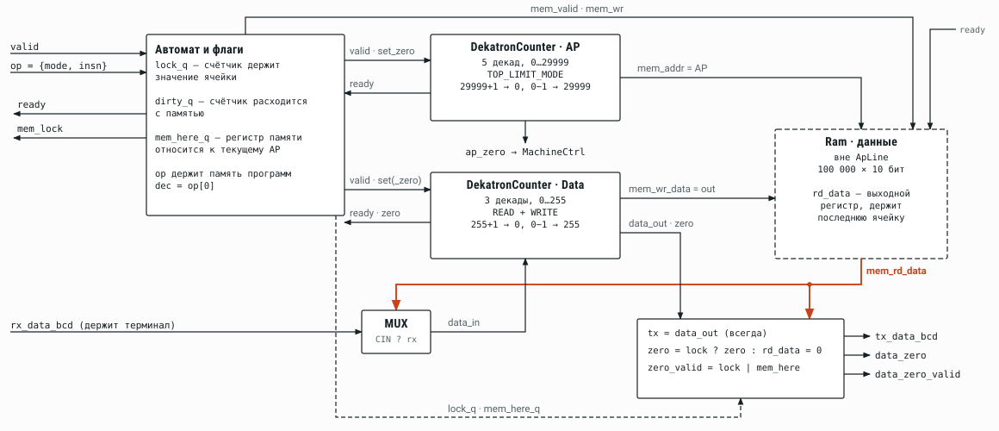

**Структура.** Оранжевым — путь значения ячейки из выходного регистра памяти: на мультиплексор входа счётчика и на выходные признаки. data_zero_valid = lock | mem_here.

**Автомат.** Оранжевым — чтение по требованию.

> **Дефект, отмечен пунктиром.** Шаг адреса без выгрузки (dirty = 0) оставляет lock = 1, если перед этим был STORE, — и следующие `.` или `+` работают со значением прежней ячейки. Правка (сброс lock при любой смене адреса) подготовлена, в ветку claude_nextGen не внесена.

### Флаги и обращения к памяти

| Операция | Когда читает память | Когда пишет память | lock · dirty · mem_here после |
|---|---|---|---|
| `+ −` | нет lock и нет mem_here | — | 1 · 1 · — |
| `> <`, CLRA | — | если dirty | 0 · 0 · 0; в ветке при dirty = 0 lock остаётся (дефект) |
| `.` COUT | нет lock и нет mem_here | — | — · — · 1 после чтения; без lock ячейка грузится в счётчик, lock не меняется |
| TEST | нет lock и нет mem_here | — | — · — · 1 после чтения |
| `,` CIN, `[-]` CLRD | — | — | 1 · 1 · — |
| LOAD | нет mem_here | — | lock не меняется |
| STORE | — | всегда | — · 0 · 1 |
| CLRML | — | если dirty | 0 · 0 · — |

## Управление машиной MachineCtrl

*ЛИСТ 6 · ДПК-СХ-06 · источник: MachineCtrl.sv*

MachineCtrl дешифрует инструкцию по паре {insn_mode, insn} и выдаёт ровно одну операцию на линию выборки, линию данных, терминал или реле сброса. В Brainfuck ISA перед скобкой, если признак нуля не достоверен, он выдаёт ApLine саму скобку (TEST) — одно чтение на проверку, не на каждый шаг промотки. Кодом операции ApLine служит сама инструкция {insn_mode, insn}, IpLine получает один бит ip_clr (REQ-APV2-008).

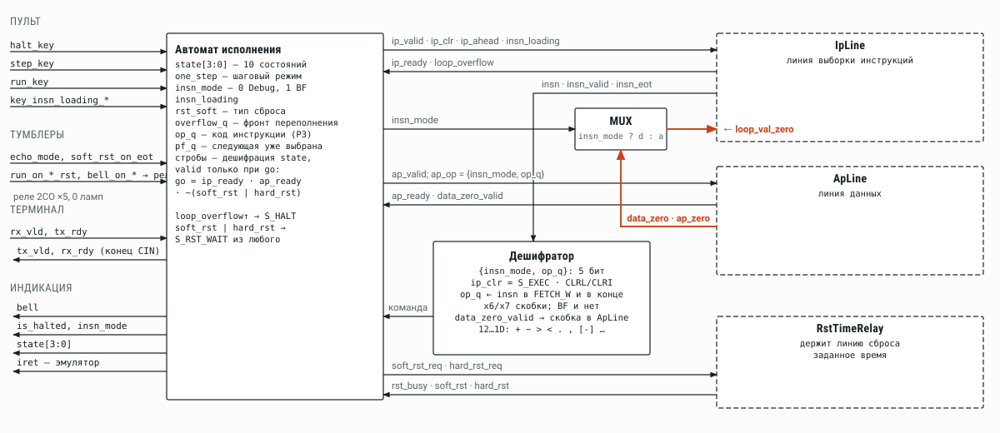

**Структура.** loop_val_zero для IpLine: в Brainfuck ISA — нуль ячейки, в Debug ISA — нуль счётчика адреса. Тумблеры звонка и выбор пуска после сброса сделаны на реле 2CO, а не на лампах (REQ-MOD-011); echo_mode и soft_rst_on_eot идут в автомат напрямую.

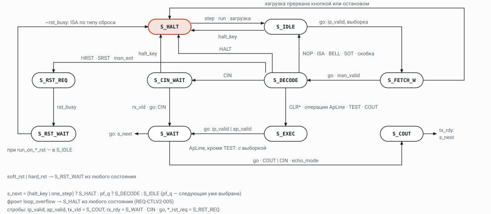

**Автомат.** Стробы дешифрируются из состояния, операция ApLine — сама инструкция; пар OP/WAIT нет (REQ-CTLV2-010). Вывод: «.» сначала уходит в ApLine как COUT, tx_vld — по его окончании (OPEN-017).

## Машина целиком DekatronPC

*ЛИСТ 7 · ДПК-СХ-07 · источник: DekatronPC.sv*

Арбитраж памяти не нужен: IpLine владеет IpMemory, ApLine — Ram. Сброс счётчиков любой природы — с пульта или инструкцией — проходит через реле времени, а MachineCtrl видит сами линии и сбрасывает общее состояние машины. Различие soft и hard — только в адресе, с которого стартует IP.

**Верхний уровень.** Оранжевым — физические линии сброса и путь значения ячейки. Второй порт чтения памятей нужен только эмулятору.

> **Проверить в TOP:** экземпляры Ram и IpMemory не передают BANK_DIGITS и CELLS, поэтому берутся значения по умолчанию: BANK_DIGITS = 4, память данных на 100 000 ячеек — 10 банков, около 100 блоков M10K вместо 30 при CELLS = 30 000.

---

Конструктив, тепловой режим и внешний вид машины в этот документ не входят. Схемы и этот файл генерируются скриптом [`tools/schemes/build.py`](tools/schemes/README.md), править их вручную не нужно.
